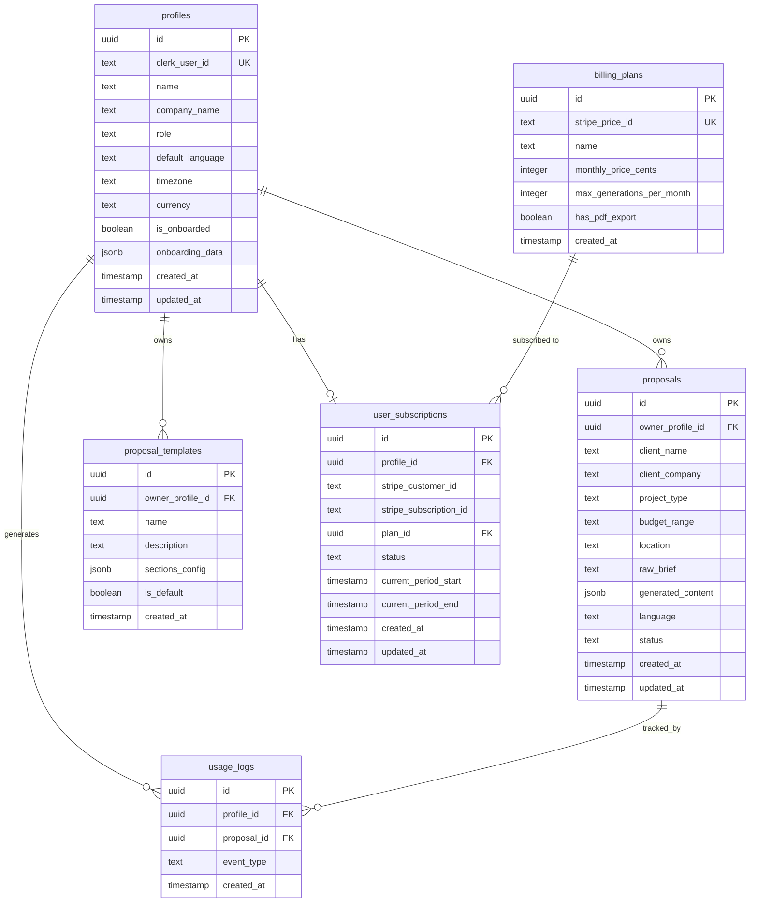

# AVProposal.ai — Database Schema (v0)

## Entity Relationship

## Tables

### `profiles`
User profile linked to Clerk. Created on first sign-in.

### `proposal_templates`
Reusable section templates per user. Can be default (system) or user-owned.

### `proposals`
Generated proposals with raw brief input and structured AI output.
- `status`: `draft` | `sent`
- `generated_content`: JSON with sections, pricing_table, assumptions, exclusions, next_steps

### `billing_plans`
Plans seeded at deploy (Free, Pro). Linked to Stripe price IDs.

### `user_subscriptions`
Active subscription per user. Updated via Stripe webhooks.

### `usage_logs`
Tracks events: `generation`, `regeneration`, `export`.

## RLS Policies

| Table | Policy | Rule |
|---|---|---|
| profiles | Users see own profile | `auth.uid() = clerk_user_id` (via Clerk JWT) |
| proposals | Users see own proposals | `owner_profile_id = current_profile_id()` |
| proposal_templates | Users see own + defaults | `owner_profile_id = current_profile_id() OR is_default = true` |
| user_subscriptions | Users see own subscription | `profile_id = current_profile_id()` |
| usage_logs | Users see own logs | `profile_id = current_profile_id()` |
| billing_plans | Public read | All authenticated users can read |

> **Note**: RLS will use a `current_profile_id()` helper function that resolves the Clerk JWT claim to a profile UUID.
